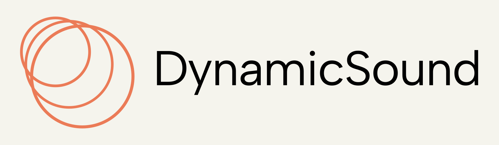

# DynamicSound Simulator

DynamicSound Simulator is a modular Python library designed for generating **virtual acoustic scenes** with customizable **microphone configurations**, **sound sources**, and **environmental conditions**. It is intended for research, algorithm development, and testing in areas such as **beamforming**, **source localization**, **audio augmentation**, and **acoustic machine learning**.

---

## 🚀 Features

- **Flexible microphone models**
  - Single-channel microphones
  - Microphone arrays with arbitrary geometry
  - User-defined sampling rates

- **Configurable sound sources**
  - White noise generator
  - Sinusoidal signal generator
  - Audio file source

- **Environmental modeling**
  - Source and microphone trajectories
  - Air absorption based on **ISO 9613-1**
  - Temperature, pressure, and humidity parameters

- **Signal path simulation**
  - Distance-based attenuation
  - Image-source reflections
  - Scenarios with dynamic movement

---

## 🔢 Versioning

This library follows **Semantic Versioning** using the format `M.m.p`

Where:
- **M** – Major version: incompatible API changes  
- **m** – Minor version: added functionality in a backward-compatible manner  
- **p** – Patch version: backward-compatible bug fixes  

---

## 📦 Installation

### From PyPI
```bash
pip install dynamicsound
```

---

## 🚀 Usage Example

```python
import dynamic_sound as ds

source_path = ds.Path([
    [0.0,  343, 3, 1,   1, 0, 0, 0],
    [10.0, -343, 3, 1,   1, 0, 0, 0]
])
microphone_path = ds.Path([
    [0.0,  0, 0, 1,   1, 0, 0, 0],
    [10.0,  0, 0, 1,   1, 0, 0, 0]
])

# simulation environment
sim = ds.Simulation(
    temperature=20,
    pressure=1,
    relative_humidity=50
)

# microphone
mic_sample_rate = 48_000
microphone = ds.microphones.Microphone("_tmp/sine_dynamic.wav", sample_rate=mic_sample_rate)
sim.add_microphone(path=microphone_path, microphone=microphone)

# source
source = ds.sources.SineWave(frequency=2_000, amplitude=1.0)
sim.add_source(
    path=source_path,
    source=source
)

sim.run()
```

More examples available inside `examples` folder.


---

# 🤝 How to contribute

Contributions are welcome!
Please open an issue or submit a merge request following GitLab’s standard workflow.


## Clone project
```bash
git clone <repository_name>
```


## 📂 Project structure

```
📂dynamic-sound
 ├─📂docs\
 ├─📂examples\
 │  ├─📂resources/
 │  |  ├─📂paths/
 |  |  |  └─📄*.csv
 │  |  └─📂sounds/
 |  |     └─🔊*.wav
 |  └─📄*.ipynb
 ├─📂src\
 │  └─📂dynamic_sound/
 │     ├─📂acoustics/
 │     |  └─📂standards/
 │     |     ├─📄__init__.py
 │     |     └─📄ISO_9613_1_1993.py
 │     ├─📂environment/
 |     |  ├─📄__init__.py
 |     |  ├─📄_air.py
 |     |  └─📄_path.py
 │     ├─📂microphones/
 |     |  ├─📄__init__.py
 |     |  ├─📄_hedraphones.py
 |     |  └─📄_microphones.py
 │     ├─📂sources/
 |     |  ├─📄__init__.py
 |     |  ├─📄_audio_file.py
 |     |  ├─📄_sine_wave.py
 |     |  ├─📄_source.py
 |     |  └─📄_white_noise.py
 │     ├─📄__init__.py
 │     ├─📄_simulation.py
 │     └─📄py.typed
 ├─📂tests\
 |  └─📄test_simulation.py
 ├─📄.gitignore
 ├─📄.gitlab-ci.yml
 ├─📄pyproject.toml
 └─📄README.md
```


## 🛠️ Development Installation

### Install `uv`

- windows
```powershell
powershell -ExecutionPolicy ByPass -c "irm https://astral.sh/uv/install.ps1 | iex"
```

- Linux and MacOS
```bash
curl -LsSf https://astral.sh/uv/install.sh | sh
```

more details in the official [uv documentation](https://docs.astral.sh/uv/getting-started/installation/#standalone-installer)

### Generate the Environment
To install in editable/development mode:

```bash
uv sync
```

### Open the examples with Jupyter Lab

- windows
```bash
.venv\Scripts\activate.bat
jupyter lab
```

- Linux and MacOS
```bash
source .venv/bin/activate
jupyter lab
```

Open one of the *.ipynb inside the examples folder and run it.

---

## 🧪 Running Tests

```bash
uv run pytest --cov=src --cov-report=term-missing --cov-fail-under=80 --capture=no
```

---

## 📜 License
This project is licensed under the Apache License 2.0.
See the full license text in [LICENSE.txt](LICENSE.txt).